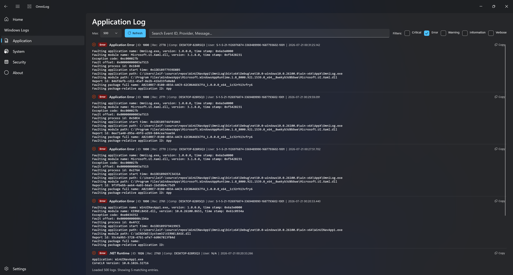

# OmniLog

OmniLog is a dark-mode Windows Event Viewer replacement built with C# and WinUI 3. It allows you to easily read and search logs on Windows 11.



## Develop locally

### Prerequisites
- [.NET 10 SDK](https://dotnet.microsoft.com/download).
- [Visual Studio 2026](https://visualstudio.microsoft.com/) 
- Ensure **.NET Desktop Development** and **Windows Application Development** workloads are checked in Visual Studio Installer.

### How to Build & Run
Choose one of the following methods:

#### Using .NET CLI
1. Open PowerShell at the project folder `OmniLog`.
2. Run the application target:
   ```powershell
   dotnet run --project OmniLog.csproj
   ```

#### Using Visual Studio
1. Open [OmniLog.slnx](file:///C:/Users/leif-/source/repos/WinUINavApp1/OmniLog.slnx) in Visual Studio 2022.
2. Select your build architecture configuration (e.g., `x64` and `Debug` or `Release`).
3. Press **F5** or click the **Start Debugging** play button.

---

> [!IMPORTANT]
> Querying the **Security** log requires running Visual Studio or the application terminal as **Administrator**. Standard logs like **Application** and **System** logs can be read by standard user privileges. Thus Security Page is not yet implemented.
